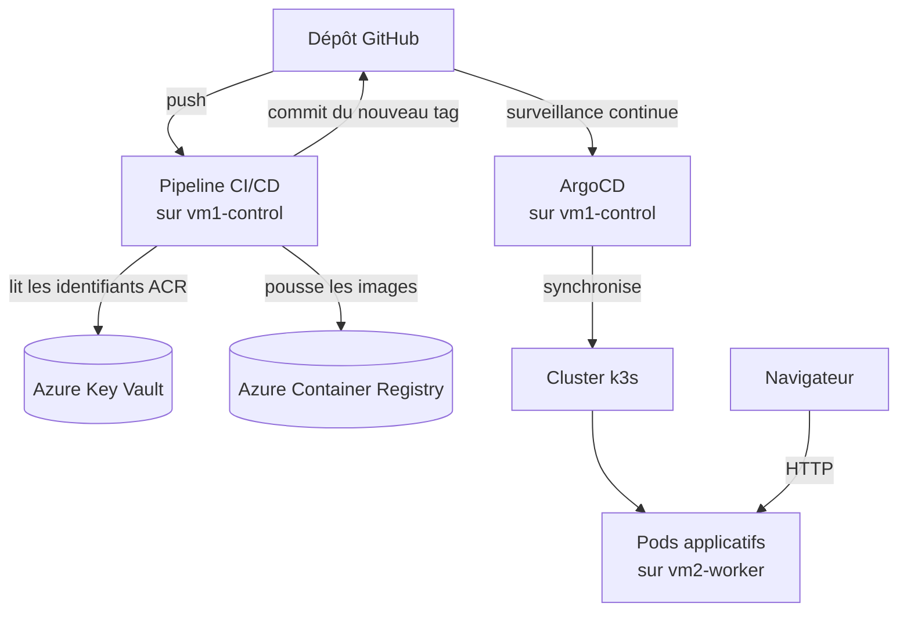

# DXC Ops & Deployment Dashboard

**Plateforme DevOps de bout en bout — de l'Infrastructure as Code à un déploiement cloud sécurisé, entièrement automatisé.**


---

## Aperçu

Ce projet est un tableau de bord de gestion des opérations et des
déploiements, mais l'essentiel du travail réside dans la **plateforme
qui le fait tourner** : une chaîne DevOps complète, réellement déployée
sur Azure — pas une simulation locale — couvrant le provisioning
d'infrastructure, l'orchestration de conteneurs, le déploiement continu
par GitOps, et un pipeline CI/CD avec des contrôles de sécurité intégrés
à chaque étape.

L'objectif : reproduire, à l'échelle d'un projet étudiant, les pratiques
réellement utilisées en environnement de production.

---

## Ce que ce projet démontre

- **Infrastructure as Code** — l'ensemble de l'infrastructure Azure
  (réseau, VMs, registre, coffre-fort de secrets) est défini en
  Terraform, avec un état distant sur Azure Blob Storage incluant le
  verrouillage automatique
- **Automatisation de la configuration** — provisioning logiciel
  entièrement scripté avec Ansible, sans intervention manuelle
- **Orchestration de conteneurs** — cluster Kubernetes multi-nœuds réel
  (k3s), et non un environnement mono-nœud de développement
- **GitOps** — déploiement continu piloté par ArgoCD : Git comme unique
  source de vérité, avec réconciliation automatique en cas de dérive
- **CI/CD avec sécurité intégrée** — pipeline GitHub Actions incluant
  détection de secrets, analyse statique (SAST), scan de vulnérabilités
  des images, et test dynamique (DAST) contre l'application en cours
  d'exécution
- **Gestion des identités et des secrets** — authentification par
  identité managée et principal de service, credentials centralisés
  dans Azure Key Vault, jamais stockés en clair
- **Ingénierie cloud maîtrisée** — architecture pensée et optimisée pour
  un budget contraint, sans sacrifier les bonnes pratiques

---

## Architecture



| Nœud | Rôle |
|---|---|
| `vm1-control` | Serveur k3s (plan de contrôle), ArgoCD, runner GitHub Actions self-hosted |
| `vm2-worker` | Agent k3s (nœud de travail), pods applicatifs, nginx-ingress |

`vm1-control` est *taint* (`node-role=control:NoSchedule`) : aucun pod
applicatif ne peut y être planifié, garantissant que toute charge
applicative réelle s'exécute sur `vm2-worker`.

---

## Stack technique

| Catégorie | Outils |
|---|---|
| Cloud | Microsoft Azure |
| Infrastructure as Code | Terraform |
| Configuration | Ansible |
| Orchestration | Kubernetes (k3s), Kustomize |
| GitOps | ArgoCD |
| CI/CD | GitHub Actions (runner self-hosted) |
| Registre & Secrets | Azure Container Registry, Azure Key Vault |
| Sécurité | Gitleaks, Bandit, Trivy, OWASP ZAP |
| Application | Python (FastAPI), JavaScript |
| Conteneurisation | Docker |

---

## Structure du dépôt

```
.
├── terraform/
│   ├── main.tf                  # ressources Azure : RG, VNet, NSG, VMs, ACR, Key Vault
│   ├── variables.tf
│   ├── terraform.tfvars         # non versionné — IP autorisée en SSH
│   └── backend.hcl              # non versionné — backend Blob Storage
├── ansible/
│   ├── inventory.ini            # non versionné — IPs publiques des VMs
│   └── playbook.yml             # installation k3s, Docker, runner GitHub
├── argocd/
│   ├── dev-application.yaml
│   └── prod-application.yaml
├── k8s/
│   ├── base/                    # manifests communs (Deployments, Services)
│   └── overlays/
│       ├── dev/                 # branche dev → namespace dxc-dashboard-dev
│       └── production/          # branche main → namespace dxc-dashboard-prod
├── backend/                     # code source de l'API
├── frontend/                    # code source de l'interface
├── .github/workflows/
│   ├── ci.yml                   # lint, tests, scans (secrets, SAST, images)
│   └── publish.yml              # build, push ACR, scan DAST, mise à jour du tag
└── docker-compose.yml           # développement local uniquement
```

---

## Prérequis (Fedora 42)

```bash
# Azure CLI
sudo rpm --import https://packages.microsoft.com/keys/microsoft.asc
sudo dnf install -y https://packages.microsoft.com/config/rhel/9.0/packages-microsoft-prod.rpm
sudo dnf install -y azure-cli
az login

# Terraform (binaire statique — vérifier la dernière version sur releases.hashicorp.com)
sudo dnf install -y dnf-plugins-core unzip
curl -O https://releases.hashicorp.com/terraform/1.9.8/terraform_1.9.8_linux_amd64.zip
unzip terraform_1.9.8_linux_amd64.zip
sudo mv terraform /usr/local/bin/

# Ansible
sudo dnf install -y ansible

# Clé SSH
ls ~/.ssh/id_rsa.pub || ssh-keygen -t rsa -b 4096
```

---

## Déploiement complet, étape par étape

### 1. Backend Terraform distant (une seule fois, persistant)

```hcl
# terraform/backend.hcl
resource_group_name  = "devflow-tfstate-rg"
storage_account_name = "<nom_du_compte_de_stockage>"
container_name        = "tfstate"
key                    = "devflow.tfstate"
use_azuread_auth       = true
```

```bash
cd terraform
terraform init -backend-config=backend.hcl
```

### 2. Provisionner l'infrastructure Azure

```bash
echo 'my_ip = "<votre_ip>"' > terraform.tfvars   # curl ifconfig.me
terraform apply
terraform output   # IP publiques vm1/vm2, acr_login_server
```

### 3. Configurer les VMs avec Ansible

```bash
cd ../ansible
cp inventory.ini.example inventory.ini   # remplir avec les IP obtenues
```

Jeton runner : **repo GitHub → Settings → Actions → Runners → New
self-hosted runner** (valable ~1h).

```bash
ansible-playbook -i inventory.ini playbook.yml \
  -e "github_runner_token=<jeton>" \
  -e "github_repo=<utilisateur>/DXC-Ops-Deployment-Dashboard"
```

Vérification : `ssh azureuser@<ip_vm1> "sudo k3s kubectl get nodes"` —
les deux nœuds doivent être `Ready`.

### 4. Installer ArgoCD

```bash
ssh azureuser@<ip_vm1>
sudo k3s kubectl create namespace argocd
sudo k3s kubectl apply -n argocd -f https://raw.githubusercontent.com/argoproj/argo-cd/stable/manifests/install.yaml
```

### 5. Installer nginx-ingress (remplace Traefik)

```bash
sudo k3s kubectl -n kube-system delete helmchart traefik traefik-crd
sudo k3s kubectl apply -f https://raw.githubusercontent.com/kubernetes/ingress-nginx/controller-v1.11.2/deploy/static/provider/baremetal/deploy.yaml
```

### 6. Key Vault et identités

Identité managée déjà attachée à `vm1-control` via Terraform. Service
Principal pour GitHub Actions :

```bash
KEYVAULT_ID=$(az keyvault show --name <vault> --resource-group devflow-rg-v3 --query id -o tsv)
az ad sp create-for-rbac --name "dxc-ops-keyvault-reader" \
  --role "Key Vault Secrets User" --scopes $KEYVAULT_ID
```

Résultat à ajouter comme secret GitHub `AZURE_CREDENTIALS`.

### 7. Secret de pull ACR dans le cluster

```bash
ssh azureuser@<ip_vm1>
az login --identity
ACR_USER=$(az keyvault secret show --vault-name <vault> --name acr-username --query value -o tsv)
ACR_PASS=$(az keyvault secret show --vault-name <vault> --name acr-password --query value -o tsv)

for ns in dxc-dashboard-dev dxc-dashboard-prod; do
  sudo k3s kubectl create secret docker-registry acr-secret \
    --docker-server=<acr_login_server> \
    --docker-username=$ACR_USER --docker-password=$ACR_PASS -n $ns
done
```

### 8. Appliquer les Applications ArgoCD

```bash
scp argocd/*.yaml azureuser@<ip_vm1>:~
ssh azureuser@<ip_vm1> "sudo k3s kubectl apply -f dev-application.yaml -f prod-application.yaml"
```

### 9. Accès public

```bash
sudo k3s kubectl get svc -n ingress-nginx   # noter le NodePort du port 80
```
```
http://dev.<ip_vm2_avec_tirets>.nip.io:<nodeport>
http://dxc.<ip_vm2_avec_tirets>.nip.io:<nodeport>
```

---

## Pipeline CI/CD

**`ci.yml`** (push `main`/`dev`, pull requests vers `main`, exécuté sur
le runner self-hosted) : Gitleaks, Ruff, Bandit, Pytest, Trivy (images
+ manifests).

**`publish.yml`** : authentification Azure → lecture des identifiants
ACR dans Key Vault → build et push des images → scan DAST (OWASP ZAP)
contre le backend démarré → mise à jour du `newTag` dans l'overlay
Kustomize concerné → commit et push.

Déclencheur de `ci.yml` limité à `paths: ['backend/**', 'frontend/**']`
pour éviter qu'un commit de mise à jour du tag ne redéclenche le
pipeline indéfiniment.

**Secret GitHub requis** : `AZURE_CREDENTIALS` (JSON du Service
Principal).

---

## Opérations courantes

```bash
# Pause (arrêt de la facturation compute)
az vm deallocate --resource-group devflow-rg-v3 --name vm1-control
az vm deallocate --resource-group devflow-rg-v3 --name vm2-worker

# Reprise
az vm start --resource-group devflow-rg-v3 --name vm1-control
az vm start --resource-group devflow-rg-v3 --name vm2-worker
```
Les IP publiques sont statiques — aucune reconfiguration nécessaire au
redémarrage.

---

## Dépannage

| Symptôme | Cause probable | Solution |
|---|---|---|
| `kubectl` : `connection refused localhost:8080` | Commande lancée sur `vm2-worker` au lieu de `vm1-control` | Toujours administrer le cluster depuis `vm1-control` |
| `ImagePullBackOff` | `imagePullSecrets` absent du Deployment, ou secret `acr-secret` manquant | `kubectl describe pod`, recréer le secret et/ou ajouter `imagePullSecrets` |
| `newTag` non appliqué | `name:` du `kustomization.yaml` ne correspond pas au registre réel | Aligner `name:` avec le chemin ACR effectif |
| Runner : erreur `node24` non supporté | Binaire du runner obsolète | Mettre à jour depuis `actions/runner/releases` |
| `docker buildx` introuvable | `docker.io` (dépôt Ubuntu) sans Buildx | Installer via le dépôt officiel Docker |
| Démon Docker arrêté après redémarrage de VM | Service non activé au démarrage | `systemctl enable docker` |
| `/api` ne répond pas alors que le site s'affiche | Accès direct au NodePort du frontend, Ingress contourné | Toujours passer par le hostname de l'Ingress |
| SSH refusé après changement de réseau | IP locale différente de la règle NSG | `terraform apply` après mise à jour de `my_ip` |

---

## Destruction des ressources

```bash
cd terraform
terraform destroy
```
Si erreur de mise hors tension sur des VMs déjà désallouées : les
redémarrer (`az vm start`) puis relancer `terraform destroy`. Ne jamais
supprimer `devflow-tfstate-rg` (état Terraform distant).

---

## Auteur

**Ahmed Yassine NADIR** — étudiant ingénieur, filière Ingénierie de l'Information Numérique, 
spécialisation DevOps & Data Engineering, ESI Rabat.
